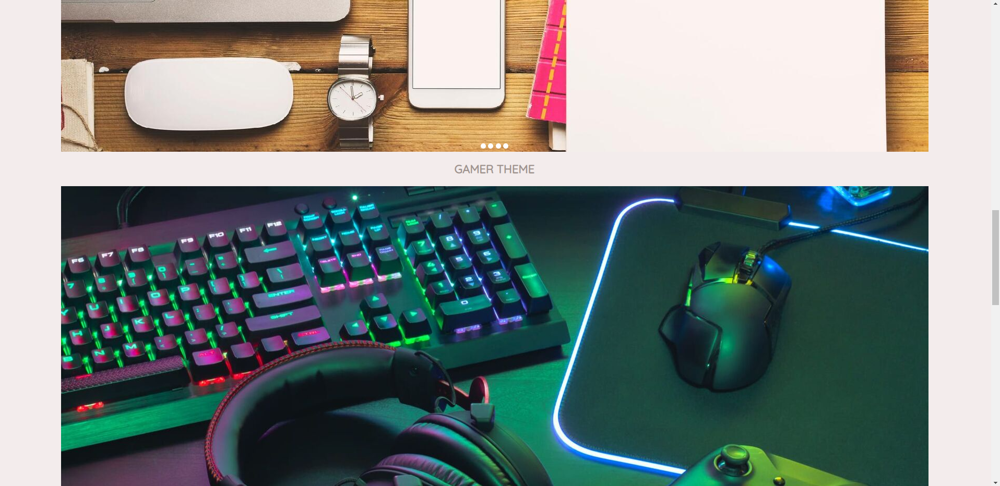
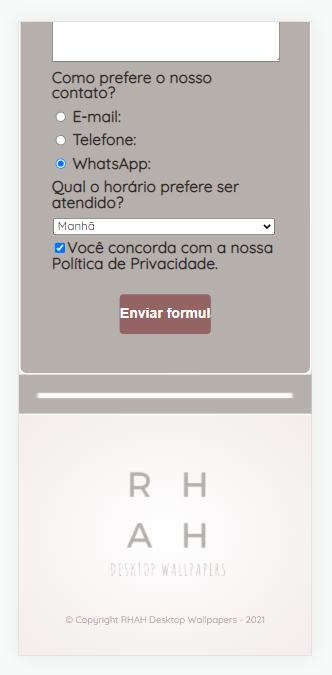

# WALLPAPER WEBSITE

## ABOUT

This repository is for my **first solo project**, where I applied my initial knowledge of **HTML5** and **CSS3**.

Its primary purpose is to condense what I have already studied of HTML5 and CSS3 through the development of a **_slider_** and a **_form_**, as well as the website itself. 

Using **only** HTML5 and CSS3, I implemented the _slider_ and the _form_ on a website that provides wallpapers. 

## FUNCTIONALITIES

### HOME PAGE

Here, the user gets the main information about the website, such as the presentation of the wallpaper themes available for download and how to download them. 

### WALLPAPERS

In the "_Wallpapers_" tab are available the wallpapers distributed in **slider** and separated according to theme. 

### FALE CONOSCO

In the "_Fale Conosco_" tab the user has the option to fill out a **form**, in which he can contribute with questions, compliments, suggestions or complaints. 

## STATUS

🚧 Finished 🚧

## 🛠 TECHNOLOGIES

The following tools were used in the construction of the project:

- [Visual Studio Code](https://code.visualstudio.com/)
- [HTML5](https://html.com/)
- [CSS3](https://www.w3.org/Style/CSS/Overview.en.html)

## RESULT

### INDEX.HTML:

<h1>
  
  
</h1>

### WALLPAPERS.HTML:

<h1>
  
  
  
  
  
</h1>

### FALE-CONOSCO.HTML:

<h1>
  
  
</h1>

## RESPONSIVE VERSION

Developed based on the importance of always making a web page responsive.

#### Responsive index.html

#### Responsive wallpapers.html

#### Responsive fale-conosco.html

## AUTHOR

Rhamanda Cathyanna Lima Paiva.